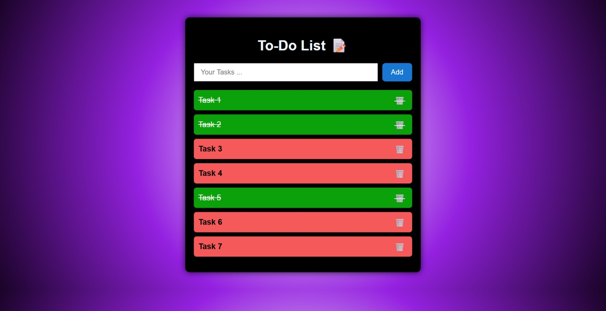

# 📝 Simple To-Do List App

A simple and responsive to-do list app built with **React**. It allows users to add, delete, and mark tasks as done or undone.

## ✨ Features

- ➕ Add new tasks  
- 🗑️ Delete existing tasks  
- ✅ Toggle tasks between completed and uncompleted  
- 📱 Responsive design (works on all screen sizes)
